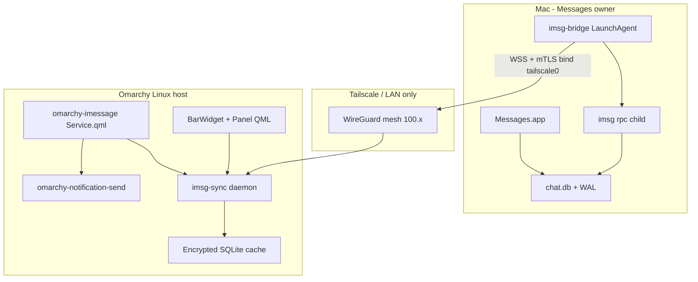

# Omarchy iMessage Plugin — Research & Architecture Plan

## Build governance (poteto-mode)

**This entire build runs under `/poteto-mode`.** Every session starts by reading the Principles section in full. Every phase follows the matched playbook. Every PR gets its own verification receipts.

### Execution playbook

`playbooks/autopilot-stack.md` — build and verify the full stack with autonomy, deliver as a linear Graphite stack, operator lands.

### Tech stack (locked)

| Layer | Component | Language | Why |
|-------|-----------|----------|-----|
| Mac daemon | `imsg-bridge` | **Rust** | TLS, long-lived WSS, `imsg rpc` child supervision, single static binary |
| Linux daemon | `imsg-sync` | **Rust** | Encrypted cache, reconnect logic, Unix socket API |
| Omarchy UI | `omarchy-imessage` | **QML + JavaScript** | Required by Omarchy plugin contract; no Rust in the shell |

The plugin is **not** Rust. Rust owns the two daemons only. QML/JS owns everything inside `omarchy-shell`.

### PR stack (sequence-verifiable-units)

```
main
 └── PR-0  prototype spike (throwaway or docs-only evidence)
      └── PR-1  bridge/ + proto/v1.md
           └── PR-2  sync/
                └── PR-3  plugin/
                     └── PR-4  hardening (attachments, search, docs)
```

Each PR is one verifiable unit. Merge order is strict. No PR starts until its parent merges or branches from it per autopilot-stack rules.

### Per-PR workflow (Feature playbook)

Every PR owner runs these steps in order:

1. **`how`** over the affected subsystem before design changes.
2. **`architect`** for parallel design exploration when crossing function boundaries (bridge↔imsg, sync↔plugin, wire protocol). Skip only with `architect skipped: <reason>`.
3. **Throughput checkpoint** (four items, never dropped):
   - **Blocking first steps.** FDA grant, pairing certs, `imsg rpc` mock — gates before fan-out.
   - **Independent workstreams.** `bridge/` and `sync/` are disjoint until integration; `plugin/` reads Unix socket only.
   - **Shared mutable state.** `proto/v1.md` is the single wire contract; serialize edits. Cache schema owned by `sync/` only.
   - **Smallest safe decomposition.** One owner per PR; subagents get explicit file ownership.
4. **Delegate** implementation to `poteto-agent` subagents with named data shapes (see Domain model below). Review every diff yourself.
5. **Verify** on the matching surface (`control-cli` for daemons, Omarchy shell for plugin UI). "Inconclusive" is not a pass.
6. **Commit** liberally; rebase into ordered commits before PR.
7. **`interrogate`** before shipping if design is contested (security model, send opt-in, attachment serving).
8. **`/deslop`** before each commit; **`/no-comments`** before review; **`security-review`** on PR-1 and PR-4.
9. **Opening a PR** per `playbooks/opening-a-pr.md`.

### Skills routed by surface

| Surface | Control skill | When |
|---------|---------------|------|
| `imsg-bridge`, `imsg-sync` CLIs | `control-cli` | Unit + live daemon verification |
| Omarchy plugin panel/UI | Omarchy shell + `omarchy plugin validate` + `qmllint` | PR-3 live lanes |
| Security boundaries | `security-review` subagent | PR-1, PR-4 |
| Wire protocol design | `architect` + `interrogate` | PR-1 before implementation |
| Decision trail | `show-me-your-work` | Committed to `docs/decisions/` for irreversible choices |

### Domain model (model-the-domain)

Name the data shape before any code. Organize as typed records + state machines at boundaries:

```
Chat       { id, guid, name, participants[], last_message_at, unread_count }
Message    { id, chat_id, guid, sender, text, created_at, is_from_me, attachments[] }
SyncCursor { chat_id, oldest_rowid, newest_rowid, db_generation }
BridgeState = Disconnected | Pairing | Connected | Degraded(reason)
```

Bridge owns `BridgeState` + `imsg rpc` child lifecycle. Sync owns `SyncCursor` + encrypted SQLite. Plugin owns presentation state only; reads from sync via Unix socket.

### Principles that govern key decisions

| Principle | Decision it drove |
|-----------|-------------------|
| **Boundary Discipline** | Plugin never touches network; sync never exposes Mac paths; bridge never raw-passthroughs `imsg` RPC |
| **Separate Before Serializing Shared State** | One `watch.subscribe` on Mac; fanout in bridge; single writer to Linux cache |
| **Subtract Before You Add** | No send in v1; no SSH passthrough in production; no second Quickshell process |
| **Prove It Works** | Every PR has unit + live verification; prototype evidence in PR-0 |
| **Build the Lever** | PR-0 prototype script rerunnable by any reviewer |
| **Never Block on the Human** | Prototype empirical forks (history pagination, watch latency) instead of asking |
| **Experience First** | Cold-start shows cached history within 200ms; not blank until live |

### Autonomy rules

- Reversible work proceeds without asking.
- Pause for irreversible writes (force-push shared branches, deploy to production Mac, delete cached messages).
- "No" is acceptable when a feature does not earn its place in v1.

---

## Executive summary

There is **no existing Omarchy chat/iMessage plugin**. Omarchy Quattro runs a single long-lived `omarchy-shell` (Quickshell) process where UI is built as plugins (`manifest.json` + QML) installed via `omarchy plugin add`. You will build:

1. **`imsg-bridge`** (macOS) — LaunchAgent that wraps [`imsg rpc`](https://imsg.sh/rpc.html) and exposes a **constrained, read-mostly** API bound to Tailscale/LAN only.
2. **`imsg-sync`** (Linux/Omarchy) — local daemon that maintains a WebSocket to the Mac bridge, encrypted message cache, and a Unix socket API for the plugin.
3. **`omarchy-imessage`** (Omarchy plugin) — `service` + `bar-widget`/`panel` QML plugin for chat list, thread view with infinite scroll, contacts, and desktop notifications via [`omarchy-notification-send`](https://github.com/basecamp/omarchy/blob/quattro/docs/notifications.md).

**Stack (locked):** Rust for `imsg-bridge` + `imsg-sync`. QML/JS for the Omarchy plugin. See Build governance above.

---

## What we learned from documentation

### Omarchy plugin system

| Fact | Source |
|------|--------|
| Plugins live in `~/.config/omarchy/plugins/<id>/` with `manifest.json` + QML | [Shell Plugins manual](https://omarchy.org/manual/shell-plugins/) |
| Kinds: `bar-widget`, `panel`, `overlay`, `menu`, `service`, `bar` | [develop.html](https://omarchyplugins.com/develop.html) |
| Plugins run **unsandboxed** with user permissions — security must be explicit | [develop.html](https://omarchyplugins.com/develop.html) |
| Third-party IDs must be namespaced (not `omarchy.*`) | [develop.html](https://omarchyplugins.com/develop.html) |
| IPC via `omarchy-shell shell summon/call/toggle <plugin-id>` | [shell/README.md](https://github.com/basecamp/omarchy/blob/quattro/shell/README.md) |
| Built-in `omarchy.tailscale` bar widget already exists | [plugins/README.md](https://github.com/basecamp/omarchy/blob/quattro/shell/plugins/README.md) |
| Notifications via `omarchy-notification-send` (never raw `notify-send`) | [notifications.md](https://github.com/basecamp/omarchy/blob/quattro/docs/notifications.md) |
| **No first-party chat/messaging plugin** in Omarchy today | plugins README inventory |

**Implication:** You are building a **new messaging UI plugin from scratch**, not extending an existing chat plugin. Model it after `omarchy-basecamp-plugin` (bar widget + panel + background polling) plus `omarchy.notifications` (service for toasts).

### iMessage data access (`imsg`)

| Capability | API | Permission |
|------------|-----|------------|
| List chats | `chats.list` / `imsg chats` | Full Disk Access (FDA) |
| Chat history | `messages.history` | FDA |
| Forward pagination / catch-up | `messages.after` (ROWID cursor) | FDA |
| Realtime stream | `watch.subscribe` → `message` notifications | FDA |
| Contacts names | `contact_name`, `sender_name` fields | Contacts permission |
| Send messages | `send`, `send.attachment`, etc. | Automation + optional bridge |
| Attachments | `attachments` flag + on-disk paths under `~/Library/Messages/Attachments` | FDA + path validation |

**Critical macOS constraints:**
- Database path: `~/Library/Messages/chat.db` (+ WAL sidecars)
- FDA is **per-binary** — every process in the chain needs it ([imsg permissions](https://imsg.sh/permissions.html), [OpenClaw TCC notes](https://docs.openclaw.ai/channels/imessage))
- `imsg rpc` is stdio JSON-RPC — **no built-in TCP daemon**; you wrap it
- `watch.subscribe` uses kqueue + polling fallback; supports `since_rowid`, `buffer_limit`, overflow recovery via `resume_after_rowid`
- ROWID cursors are **not portable** across DB replacement — bridge must emit a `db_generation` token on rotation

**Prior art for Mac↔Linux over Tailscale:** OpenClaw/RemoteClaw use SSH wrapper (`ssh -T mac imsg "$@"`) + SCP for attachments. This works but grants **full shell access**. For "insanely safe," build a **dedicated bridge** instead.

### Codex consultation (partial)

Attempted `codex exec -m gpt-5.6-sol` from `/path/to/workspace`. Results:
- `gpt-5.6-sol-xhigh` failed: `502 unknown provider`
- `gpt-5.6-sol` session started architect workflow, identified trust boundaries:
  - Mac private data → FDA-scoped `imsg` child → network bridge → Linux transport → QML UI
- Three competing designs were being evaluated: **REST+SSE**, **multiplexed RPC**, **privacy-first minimal retention**
- Session did not complete before plan deadline (stuck in parallel agent spawn)

**Synthesis (aligned with Codex direction):** Choose **multiplexed RPC over a single WebSocket** with explicit method allowlists — simpler than REST+SSE dual channels, richer than raw `imsg` RPC passthrough.

---

## Architecture



### Data flow

1. **Mac `imsg-bridge`** spawns and supervises one `imsg rpc` child.
2. Bridge subscribes to `watch.subscribe` (all chats, `debounce_ms: 500`).
3. On connect, Linux `imsg-sync` authenticates (mTLS + pairing token), receives `status` + `db_generation`.
4. Sync performs initial `chats.list` + per-chat `messages.history` (recent window) into local cache.
5. Live `message` events append to cache; Service emits Omarchy notification for inbound `is_from_me: false`.
6. Panel reads from local Unix socket (`/run/user/$UID/imsg-sync.sock`) — **never blocks on network** for scroll/render.

---

## Security model (defense in depth)

Principles applied: **Boundary Discipline**, **Type System Discipline**, **Make Operations Idempotent**, **Subtract Before You Add**.

### Layer 1: Network isolation
- Bridge binds **only** to Tailscale interface IP (`tailscale ip -4`) or explicit LAN CIDR from config
- **Refuse** `0.0.0.0` / public interfaces — fail closed at startup
- Optional: macOS `pf` or `socketfilterfw` rule limiting inbound to `100.64.0.0/10` + RFC1918

### Layer 2: Tailscale ACLs
Example ACL snippet (adjust tailnet hostnames):

```json
{
  "acls": [
    {
      "action": "accept",
      "src": ["omarchy-laptop"],
      "dst": ["mac-imessage:18789"]
    }
  ]
}
```
- Tag Mac: `tag:imessage-bridge`
- Tag Linux clients: `tag:omarchy-imessage`
- Deny all other `dst` to bridge port by default

### Layer 3: mTLS + pairing
- Bridge generates CA + server cert on first run; stores in `~/.config/imsg-bridge/`
- Linux client receives **one-time pairing QR/code** (out-of-band: show on Mac, type on Linux)
- Pairing exchanges client cert; bridge maintains allowlist of client cert fingerprints
- **No pairing = no connection** (even on tailnet)
- Rotate certs annually; revoke via `imsg-bridge clients revoke <id>`

### Layer 4: API allowlist (read-mostly default)
Bridge exposes a **subset** of `imsg` RPC — never raw passthrough:

| Allowed (default) | Blocked (default) |
|-------------------|-------------------|
| `status`, `chats.list`, `messages.history`, `messages.after`, `messages.search` | `send`, `send.*`, `tapback`, `message.edit`, `message.unsend`, `message.delete` |
| `watch.subscribe` (server-initiated push) | `chats.create`, `poll.*`, `contacts.shareContactCard` |
| `handles.check` (read) | Any shell/exec |

Send support is a **separate opt-in config flag** requiring explicit `enable_send: true` on both Mac and Linux, plus Automation permission on Mac.

### Layer 5: Attachment serving
- Never expose raw filesystem paths over the wire
- Bridge serves attachments via `GET /attachments/<attachment_id>` where `attachment_id` is HMAC(chat_guid + message_guid + filename, server_secret)
- Validate resolved path stays under `~/Library/Messages/Attachments` (same pattern as [OpenClaw remoteAttachmentRoots](https://docs.openclaw.ai/channels/imessage))
- Max size cap (e.g. 25 MB), rate limit per client

### Layer 6: Linux local cache
- Cache at `~/.local/state/omarchy-imessage/cache.db` encrypted with Linux keyring (libsecret)
- Plugin reads cache only — no direct network from QML
- `imsg-sync` is the sole network client; runs as user systemd service

### Layer 7: Omarchy plugin hygiene
- QML uses `Process` only to talk to local Unix socket helper — **no** `imsg`, `ssh`, or bridge URLs in QML
- Notification click: `omarchy-notification-send ... --exec omarchy-shell shell summon io.github.panic.imessage '{"chat_id":42}'`
- Document all privileges in README (Omarchy requires this per [develop.html](https://omarchyplugins.com/develop.html))

---

## Wire protocol: `imsg-bridge/v1`

Single **WebSocket** (WSS) with JSON messages. Not a blind proxy of `imsg` RPC — typed envelope:

```json
// Client → Server (request)
{"type":"req","id":"1","method":"chats.list","params":{"limit":50}}

// Server → Client (response)
{"type":"res","id":"1","ok":true,"result":{"chats":[...]}}

// Server → Client (push, from watch)
{"type":"event","topic":"message","payload":{...Message...}}

// Server → Client (lifecycle)
{"type":"event","topic":"db.generation","payload":{"generation":"uuid","at":"..."}}
```

### Methods (v1)

| Method | Purpose |
|--------|---------|
| `status` | Bridge + imsg readiness, permissions, `db_generation` |
| `chats.list` | Paginated chat list (`limit`, `cursor`) |
| `messages.history` | Per-chat window (`chat_id`, `limit`, `before` ISO8601) |
| `messages.after` | ROWID catch-up (`chat_id`, `since_rowid`, `limit`) |
| `messages.search` | Local search |
| `watch.ack` | Client confirms processed `message` events (for backpressure) |
| `attachments.fetch` | Returns short-lived token URL for binary fetch |

**Heartbeat:** ping/pong every 30s; disconnect after 3 misses.

**Backpressure:** If Linux client stops acking, bridge pauses watch fanout (mirrors `imsg` `buffer_limit` semantics).

---

## Mac bridge (`imsg-bridge`)

### Responsibilities
- LaunchAgent under **logged-in user** (not LaunchDaemon — root cannot get TCC/FDA)
- Supervise `imsg rpc` child; restart on crash with exponential backoff
- Translate WebSocket requests → JSON-RPC to `imsg` stdin; map responses back
- Maintain single `watch.subscribe` subscription; fan out events to connected clients
- Bind WSS to Tailscale IP only
- Log redacted access (no message bodies in logs by default)

### macOS permissions checklist
Add to System Settings → Privacy & Security → Full Disk Access:
1. `imsg-bridge` binary (actual Mach-O, not wrapper script)
2. `imsg` binary (`/opt/homebrew/bin/imsg` or resolved real path)
3. Terminal used for initial setup (if applicable)

Optional for contacts: Contacts permission for `imsg`.
Optional for send: Automation → Messages.

### Install
```bash
brew install steipete/tap/imsg
# install imsg-bridge binary to ~/.local/bin or /opt/homebrew/bin
imsg-bridge init          # generates mTLS CA, pairing code
imsg-bridge pair          # show QR for Linux client
launchctl load ~/Library/LaunchAgents/com.panic.imsg-bridge.plist
```

### LaunchAgent sketch
- `RunAtLoad=true`, `KeepAlive=true`
- `ProgramArguments`: `imsg-bridge serve --bind <tailscale-ip>:18789 --config ~/.config/imsg-bridge/config.toml`
- `StandardOutPath` / `StandardErrorPath` for diagnostics (redacted)

---

## Linux sync daemon (`imsg-sync`)

### Responsibilities
- systemd user service: `imsg-sync.service`
- Maintains persistent WSS to Mac bridge (reconnect with jitter)
- Populates encrypted SQLite cache: `chats`, `messages`, `contacts`, `sync_cursors`
- Exposes Unix socket API (JSON lines) for Omarchy plugin — same method names as bridge
- Handles attachment download to `~/.cache/omarchy-imessage/attachments/` with size limits
- Emits desktop notifications for new inbound messages (configurable per-chat mute)

### Unix socket API (plugin-facing)
Same envelope as bridge but local only. Plugin never sees Mac hostname or certs.

---

## Omarchy plugin (`omarchy-imessage`)

### Plugin manifest
```json
{
  "schemaVersion": 1,
  "id": "io.github.panic.imessage",
  "name": "iMessage",
  "version": "0.1.0",
  "kinds": ["service", "bar-widget"],
  "entryPoints": {
    "service": "Service.qml",
    "barWidget": "BarWidget.qml"
  },
  "barWidget": {
    "displayName": "iMessage",
    "category": "Communication",
    "allowMultiple": false,
    "defaultSection": "right"
  }
}
```

### Components

| File | Role |
|------|------|
| `Service.qml` | Connects to `imsg-sync` socket; tracks unread count; fires `omarchy-notification-send` on inbound; exposes IPC `openChat(chat_id)` |
| `BarWidget.qml` | Badge with unread count; click toggles panel |
| `Panel.qml` | Split view: `ChatList.qml` + `ThreadView.qml` |
| `ChatList.qml` | Virtualized list from cache; search filter |
| `ThreadView.qml` | **Infinite scroll** (see below); composer (disabled until send opt-in) |
| `ImsgClient.js` | Unix socket client; parses NDJSON; state machine |
| `Models.js` | Chat/message/contact types |

### Infinite scroll strategy

**Initial load (open chat):**
1. Request `messages.history` with `chat_id` + `limit: 50` (no `before`) — imsg returns the **50 most recent** messages in chronological order (oldest-of-window first).
2. Render with anchor at bottom (newest visible).

**Scroll up (older messages):**
1. Track `oldest_loaded_at` (ISO8601) and `oldest_rowid` from cache.
2. Request `messages.history` with `before: oldest_loaded_at` + `limit: 50`.
3. Prepend to list; preserve scroll position (critical UX detail).
4. Stop when page returns fewer than `limit` rows.

**Live tail:**
- `watch` events append below; auto-scroll if user is pinned to bottom.
- Use `since_rowid` on reconnect for gap fill via `messages.after`.

**Cold start with history (not blank):**
- On first connect, `imsg-sync` prefetches top N chats (by `last_message_at`) + 50 messages each before plugin opens.
- Panel shows cached data immediately; subtle "syncing…" indicator while tail catches up.

### Contacts
- Display `contact_name` / `sender_name` from imsg when Contacts permission granted on Mac
- Linux cache stores handle → display name mapping
- Fallback: formatted phone/email; group chats use `display_name`
- Optional future: sync Contacts avatar hashes if imsg exposes them (not in v1 schema)

### Notifications
```bash
omarchy-notification-send \
  --app-name "iMessage" \
  -u normal \
  --image "$avatar_path" \
  "$sender_name" "$text_preview" \
  --exec omarchy-shell shell summon io.github.panic.imessage "{\"chat_id\":$CHAT_ID}"
```
- Respect Omarchy DND (don't bypass unless user configures critical)
- Per-chat mute in plugin config (`~/.config/omarchy/imessage.json`)
- Debounce burst messages (collapse "3 new messages from Alice")

---

## Repository layout (greenfield [`imsg`](.) repo)

```
imsg/
├── bridge/                 # Rust: Mac imsg-bridge
│   ├── src/
│   └── Cargo.toml
├── sync/                   # Rust: Linux imsg-sync
│   ├── src/
│   └── Cargo.toml
├── plugin/                 # Omarchy QML plugin
│   ├── manifest.json
│   ├── Service.qml
│   ├── BarWidget.qml
│   ├── Panel.qml
│   └── js/
├── proto/                  # Wire protocol schema + docs
│   └── v1.md
├── deploy/
│   ├── mac/imsg-bridge.plist
│   └── linux/imsg-sync.service
├── docs/
│   └── PLAN.md             # This plan (saved)
└── README.md
```

---

## Risks and mitigations

| Risk | Impact | Mitigation |
|------|--------|------------|
| TCC/FDA breaks after macOS update | Bridge stops reading | Document re-grant procedure; `status` surfaces missing permission clearly |
| `chat.db` rotation | Stale ROWID cursors | `db_generation` event; sync wipes cursors and refetches |
| Watch silent failure | Missed messages | imsg built-in poll fallback + sync periodic `messages.after` catch-up every 5 min |
| Omarchy plugin unsandboxed | Local privilege escalation if plugin compromised | Plugin talks only to Unix socket; no network in QML |
| SSH-style full shell (if used) | Complete Mac compromise | **Do not use SSH passthrough**; use constrained bridge |
| Sending duplicates / ghost rows | Wrong UI state | Don't enable send in v1; when enabled, use imsg debounce + `is_from_me` settling |
| Large attachment sync | Disk/bandwidth | Lazy fetch on view; size caps; user setting |
| Apple ToS / privacy | Personal liability | Local-only, user-owned devices, no cloud relay, open source |
| SIP / bridge injection limits on macOS 26 | Advanced features break | v1 is read-only DB path; no `imsg launch` required |
| QML performance on long threads | UI jank | Virtualize `ListView`; paginate; cache on disk |

---

## Phased implementation (poteto-mode PR stack)

Tests alone are not sufficient verification. Each PR is verified only when unit, live, and perf boxes are all checked.

### PR-0 — Prototype spike (playbook: `prototype.md`)

**Goal.** Prove `imsg rpc` watch + history work over Tailscale before writing Rust.

**Build.**
- Shell script on Mac runs `imsg rpc`, subscribes to `watch.subscribe`, prints NDJSON events.
- Linux receives events via Tailscale (SSH tunnel for spike only).
- Measure watch latency and history pagination with `before` timestamp.

**Verify, unit.** `imsg chats --limit 5 --json` succeeds with FDA granted.

**Verify, live.**
- Send iMessage from phone → event appears on Linux within 2s.
- `messages.history` returns 50 recent messages for one chat.
- Screenshot of terminal output saved to `docs/evidence/pr0-watch.png`.

**Deliverable.** `docs/evidence/pr0.md` with SHA, latency numbers, pagination notes. Branch may be discarded; evidence is kept.

---

### PR-1 — `imsg-bridge` (playbook: `feature.md`)

**Depends on.** PR-0 evidence merged into `docs/`.

**Files.** `bridge/`, `proto/v1.md`, `deploy/mac/imsg-bridge.plist`

**Build.**
- `architect` runs before implementation (REST+SSE vs multiplexed WSS — WSS wins per research).
- Rust crate: mTLS, method allowlist, `imsg rpc` child supervisor, `watch.subscribe` fanout.
- Bind to Tailscale IP only; fail closed on `0.0.0.0`.
- `security-review` on diff before merge-ready.

**Verify, unit.** `cargo test` in `bridge/` with mock `imsg` child fixture.

**Verify, live (`control-cli`).**
- `imsg-bridge status` reports `database.ready: true`.
- Paired Linux client connects; unpaired cert rejected.
- Live message pushed over WSS within 2s of Mac receive.

**Verify, perf.**
- Metric: watch event latency Mac DB write → WSS emit.
- Baseline: measure at trunk (N/A first PR); target p95 < 500ms.

**Review gate.** None. PR-1 is daemon-only, no UI interaction.

---

### PR-2 — `imsg-sync` (playbook: `feature.md`)

**Depends on.** PR-1 merged.

**Files.** `sync/`, `deploy/linux/imsg-sync.service`

**Build.**
- Rust crate: WSS client, encrypted SQLite cache (libsecret), Unix socket API.
- Prefetch top N chats + 50 messages on connect.
- `messages.after` catch-up on reconnect.

**Verify, unit.** `cargo test` in `sync/` for cache schema, cursor persistence, `db_generation` rotation.

**Verify, live (`control-cli`).**
- systemd user service starts, connects to bridge, populates cache.
- Unix socket `chats.list` returns prefetched data while Tailscale connected.
- Disconnect Tailscale → daemon shows offline; reconnect resumes without duplicate messages.

**Verify, perf.**
- Metric: cold cache query `chats.list` latency via Unix socket.
- Target: p95 < 50ms (local socket, not network).

**Review gate.** None.

---

### PR-3 — `omarchy-imessage` plugin (playbook: `feature.md`)

**Depends on.** PR-2 merged.

**Files.** `plugin/` (QML/JS only)

**Build.**
- Clone scaffold: `omarchy plugin clone omarchy.clock --edit` then replace with iMessage UI.
- `Service.qml` + `BarWidget.qml` + `Panel.qml` + `ImsgClient.js`.
- Infinite scroll via `messages.history` with `before` cursor.
- Notifications via `omarchy-notification-send`.
- `interrogate` on notification click argv safety before merge.

**Verify, unit.** `omarchy plugin validate plugin/` + `qmllint` pass.

**Verify, live (Omarchy shell).**
- Panel opens with cached history (not blank) within 200ms.
- Scroll up loads older messages without jump.
- Inbound message triggers toast; click opens correct chat.
- Plugin survives `omarchy-restart-shell`.

**Verify, perf.**
- Metric: thread render with 500 cached messages.
- Target: scroll remains smooth (no frame drops visible in screen recording).

**Review gate.** Operator reviews screenshots + 30s video before merge. UI interaction PR.

---

### PR-4 — Hardening (playbook: `feature.md`)

**Depends on.** PR-3 merged.

**Files.** `bridge/`, `sync/`, `plugin/`, `docs/`, `README.md`

**Build.**
- Attachment lazy fetch with path validation.
- `messages.search` wired through.
- Tailscale ACL example config in `docs/tailscale-acl.json`.
- `security-review` full stack.
- README with FDA/Contacts setup, privilege boundaries.

**Verify, unit.** Path traversal tests for attachment serving. Search returns expected results.

**Verify, live.**
- Open attachment in thread; file renders.
- Search finds message by text.
- Bridge refuses bind on non-Tailscale interface (regression).

**Review gate.** Operator reviews attachment + search screenshots.

---

### PR-5 — Optional send (later, not in v1 stack)

Explicit opt-in on Mac + Linux. `interrogate` required before starting. Separate stack after v1 lands.

---

## What we should NOT do

- **Cloud relay** — violates requirement; use Tailscale/LAN only
- **Direct `chat.db` copy to Linux** — stale, no realtime, FDA on wrong machine
- **SSH `imsg` passthrough as production API** — too broad; OK only for Phase 0 spike
- **Second Quickshell process** — forbidden by Omarchy plugin rules
- **Store message plaintext unencrypted on Linux** — encrypt cache at rest

---

## Open decisions (resolved)

1. **Rust vs Go for bridge/sync** — **Rust** (locked). Tokio + tungstenite + rustls + sqlx.
2. **Plugin language** — **QML/JS** (required by Omarchy; not negotiable).
3. **Send in v1?** — **No**. Read + notify first. PR-5 later.
4. **Multiple Mac sources?** — **Single Mac** in v1.
5. **Plugin ID** — `io.github.panic.imessage` (adjust to your GitHub org).
6. **Build workflow** — **poteto-mode** with `autopilot-stack` delivery.

---

## Verification gates (Prove It Works)

- [ ] `imsg-bridge status` reports `database.ready: true` on Mac
- [ ] Linux client pairs via mTLS; connection rejected from non-paired cert
- [ ] Bridge refuses bind on non-Tailscale interface
- [ ] Opening panel shows **cached history** within 200ms; live message arrives <2s
- [ ] Scroll up loads older messages without jump
- [ ] Inbound message triggers `omarchy-notification-send` toast; click opens correct chat
- [ ] `omarchy plugin validate` passes; plugin survives `omarchy-restart-shell`
- [ ] Disconnect Tailscale → plugin shows offline; reconnect resumes without data loss
